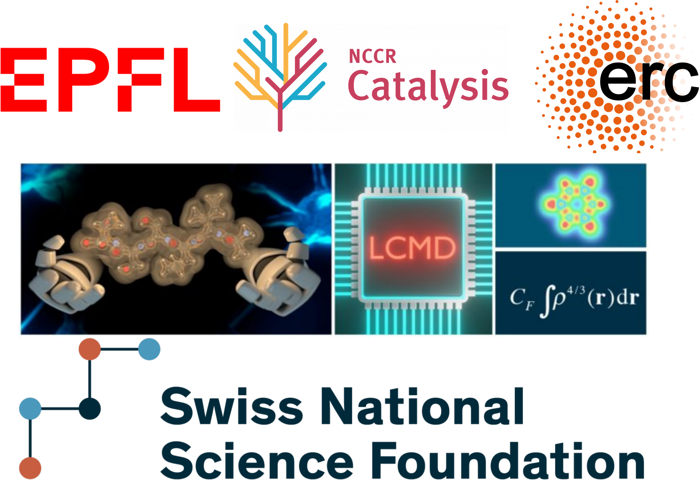

NaviCat: A platform for catalyst discovery
==========================================

## Contents
* [About](#about-)
* [Packages](#packages-)
* [Databases](#databases-)
* [Documentation](#documentation-)
* [Examples](#examples-)
* [Acknowledgements](#acknowledgements-)

## About [↑](#about)

NaviCat is a platform that collects tools for digital catalyst optimization and discovery developed at the [LCMD](https://www.epfl.ch/labs/lcmd/) in EPFL. This hub is currently under construction, hence some of the tools listed may be in development or not currently public yet.

## Packages [↑](#packages)

* [NaviCatGA](https://github.com/lcmd-epfl/NaviCatGA), a Genetic Algorithm for catalyst optimization.
* [volcanic](https://github.com/lcmd-epfl/volcanic), an automated tool for volcano plot and activity map building.
* [EPSim](https://github.com/lcmd-epfl/EPSim), a tool to calculate the  distance to Sabatier's ideal catalyst.
* [MORESIM](https://github.com/lcmd-epfl/MORESIM), a module to perform replica exchange simulations.
* [LKR](https://github.com/lcmd-epfl/Local_Kernel_Regression), a step-by-step demonstration of local kernel ridge regression for machine learning applications.

## Databases [↑](#databases)

* [Data mining the C-C cross-coupling genome](https://www.materialscloud.org/discover/ccg#mcloudHeader), a database of C-C cross-coupling transition metal catalysts and their predicted performance for different reactions.
* [Reaction representation of organocatalysts](https://github.com/lcmd-epfl/reaction-representation), a database of enantioselective organocatalyzed activation energies and the Jupyter notebooks to train ML models from it.

## Examples [↑](#examples)

Will be added as more tools are added to the project.

## Acknowledgements [↑](#contents)

The NaviCat project is funded by [NCCR Catalysis](https://www.nccr-catalysis.ch/)  of the [Swiss National Science Foundation](https://www.snf.ch/en) and by the [European Research Council](https://erc.europa.eu/) (ERC, Grant Agreement No. 817977) within the framework of European Union's H2020.

