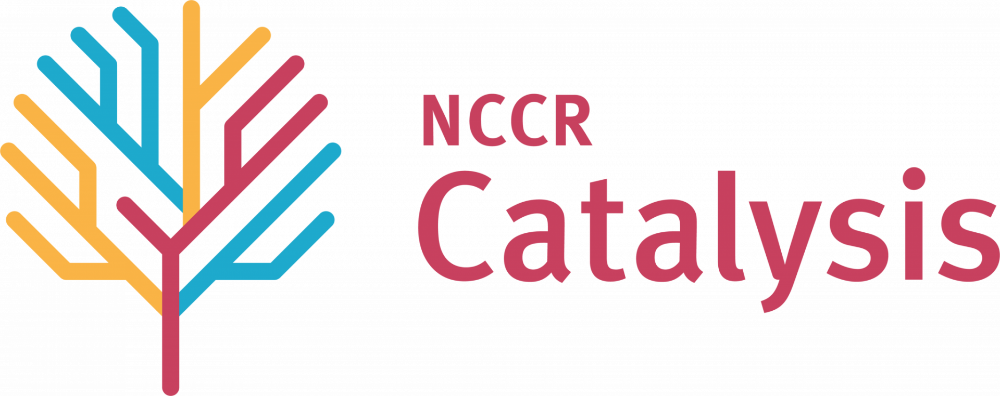

NaviCat: A platform for catalyst discovery
==========================================

## Contents
* [About](#about-)
* [Packages](#packages-)
* [Databases](#databases-)
* [Documentation](#documentation-)
* [Examples](#examples-)

## About [↑](#about)

NaviCat is a platform that collects tools for digital catalyst optimization and discovery developed at the [LCMD](https://www.epfl.ch/labs/lcmd/) in EPFL. This hub is currently under construction, hence some of the tools listed may be in development or not currently public yet.

The NaviCat project is funded within the [NCCR Catalysis](https://www.nccr-catalysis.ch/)  of the [Swiss National Science Foundation](https://www.snf.ch/en).

## Packages [↑](#packages)

* [NaviCatGA](https://github.com/lcmd-epfl/NaviCatGA), a Genetic Algorithm for catalyst optimization.
* [volcanic](https://github.com/lcmd-epfl/volcanic), an automated tool for volcano plot and activity map building.
* [EPSim](https://github.com/lcmd-epfl/EPSim), a tool to calculate the  distance to Sabatier's ideal catalyst.

## Databases [↑](#databases)

* [Data mining the C-C cross-coupling genome](https://www.materialscloud.org/discover/ccg#mcloudHeader), a database of C-C cross-coupling transition metal catalysts and their predicted performance for different reactions.

## Documentation [↑](#documentation)

Work in progress...

## Examples [↑](#examples)

Will be added as more tools are added to the project.
